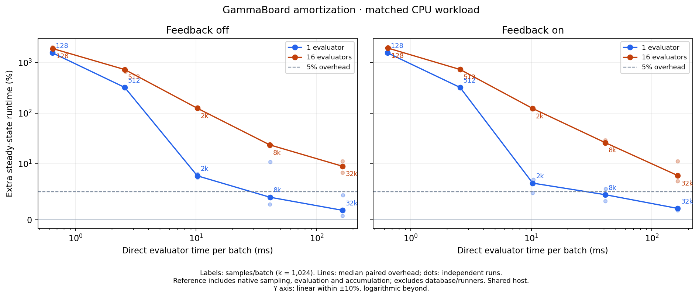

# Amortization of the native GammaBoard pipeline

[PNG](amortization.png) · [SVG](amortization.svg) · [PDF](amortization.pdf) ·
[CSV](summary.csv) · [all paired trials](results.json)



The study uses **1 and 16 evaluators**, **128, 512, 2,048, 8,192 and 32,768 samples
per transport batch**, and feedback off/on. Three fresh deployments per evaluator
count give 60 paired comparisons. Each pair compares the production PostgreSQL
queue and runners with a bounded in-memory reference using the same native sampler,
evaluator and accumulation code. Numerical engine work is included in both;
this measures deployment overhead rather than every instruction in the library.

The evaluator performs a fixed integer arithmetic workload calibrated once to
approximately 5 µs/sample and returns `x[0]`. It consumes actual CPU time, with no
artificial sleep. Six-dimensional uniform inputs, the seed, 131,072-sample
generations, feedback policy and queue settings stay fixed across the sweep.
Feedback is returned once per complete generation in order. It does not train a
model; the future GLNIS physics example is a separate validation.

The horizontal axis is measured direct evaluator call time, including local
accumulation. The vertical axis is equivalent extra steady-state runtime:

`100 × (direct accepted samples/s / GammaBoard accepted samples/s − 1)`.

Both paths discard warmup and exclude startup/final draining. Production windows
use the existing stable-identity, fresh-telemetry and accepted/evaluated-progress
checks. Small-batch windows are extended to cover at least two expected feedback
cycles under the 10 ms runner tick. The direct path measures between complete
generation boundaries after a warmup generation. It includes generation,
partitioning, materialization, evaluation, accumulation and ordered feedback, with
at most two outstanding batches per evaluator.

| Samples/batch | Direct evaluator time (ms), approximate | 1 evaluator, feedback off | 1 evaluator, feedback on | 16 evaluators, feedback off | 16 evaluators, feedback on |
| ---: | ---: | ---: | ---: | ---: | ---: |
| 128 | 0.64 | 1551.0% | 1548.7% | 1885.9% | 1927.5% |
| 512 | 2.56 | 320.9% | 321.1% | 724.5% | 726.6% |
| 2,048 | 10.24 | 7.8% | 6.5% | 124.6% | 123.2% |
| 8,192 | 40.97 | 4.0% | 4.5% | 23.5% | 26.0% |
| 32,768 | 163.81 | 1.7% | 2.0% | 9.5% | 7.9% |

Values are medians of paired run ratios. The plot shows every repetition as a
faint dot. The vertical axis is linear near zero and logarithmic beyond ±10%;
negative overhead would be retained. The CSV includes the observed run-to-run
range, which is not a confidence interval. Curves connect the measured points;
no crossover between them was measured.

The strong small-batch penalty is consistent with the 10 ms runner cycle: about
0.64 ms of evaluator work cannot amortize that cadence. Larger batches sharply
reduce overhead. The sixteen-worker fleet retains additional pipeline overhead
even at the largest tested batch. This result is specific to the selected
workload and deployment; it does not establish a universal 5% threshold, a new
throughput frontier, process-API overhead or real adaptive-training performance.

Each method uses the same evaluator core assignments and a five-core sampler
allocation; GammaBoard additionally uses four database cores, four sampler I/O
threads and a 1 GiB PostgreSQL cache. The direct coordinator uses a single thread
within its sampler allocation. Wall-time overhead does not account for the
additional database resources. Selected physical cores were idle at selection,
but the host was shared and no CPUs were reserved exclusively. Each evaluator
count/repeat gets a fresh database, while its batch-size/mode cases share that
database. Reversing method and case order on the second repeat exposes, but does
not eliminate, cache and host-load variation.

The initial pilot with a larger generation failed the training-window validity
check because no complete feedback generation returned during the short window.
Those pilot measurements are excluded. The final study holds the smaller
131,072-sample generation fixed and extends the smallest-batch windows. All final
comparisons and cleanup outcomes are retained in the data.

Reproduce with an optimized current binary from the repository root:

```bash
python -m benchmarks amortization --output results/amortization
```

The [manifest](manifest.json) records CPU assignments, calibration, exact settings
and executable/harness hashes. [Raw measurements](raw-measurements.json.gz)
contain all observation windows, direct reference measurements, run cards and
private deployment cleanup records. Native helper source hashes and the base
revision are in [native-source.json](native-source.json). Complete local inputs,
including the immutable executable and helper sources, remain at
`/common/dev/cedric/setup-logs/amortization-20261001/`.

Validation: 345 Rust library tests and eight CLI tests passed on Rust 1.94 (one
unrelated Rust test ignored); 41 Python benchmark tests passed. Formatting and
CI's exact all-targets/all-features Clippy command with warnings denied also
passed on Rust/Clippy 1.99 after correcting the constant-width chunk iteration.
All 60 comparisons had valid telemetry, matched configurations and six clean
private deployment shutdowns.
