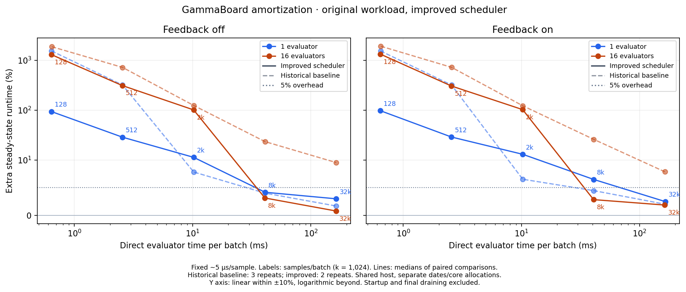
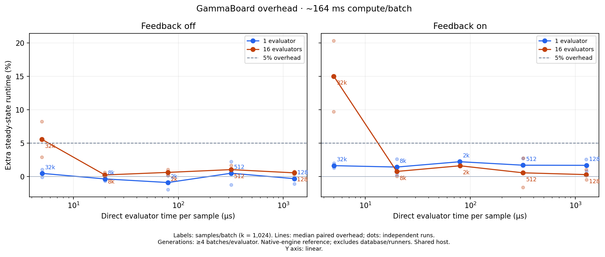

# Amortization with the improved evaluator scheduler

Current binary: `a2fe46a` (coalesced refill notifications, productive evaluator
sleep and peer-prefetch restriction removed). These are new measurements;
no old point has been adjusted using an estimated speedup.

## Original fixed-cost sweep



[PDF](before-after.pdf) · [current-only plot](fixed-cost/amortization.png) ·
[CSV](fixed-cost/summary.csv) · [all pairs](fixed-cost/results.json)

The original workload is preserved: approximately 5 µs/sample of real CPU work,
batch sizes 128 through 32,768, 131,072-sample generations, 1/16 evaluators and
feedback off/on. The dashed lines are the historical October 1 measurements;
solid lines are the new medians. The comparison spans separate dates and physical
core selections on a shared host, so this is not a controlled estimate of the
isolated scheduler effect. The historical study had three repeats and nominal
eight-second windows; this rerun has two reversed repeats and nominal four-second
windows, extended by the same generation/progress checks when necessary.

Extra runtime, historical → current:

| Samples/batch | 1 evaluator, feedback off | 1 evaluator, feedback on | 16 evaluators, feedback off | 16 evaluators, feedback on |
| ---: | ---: | ---: | ---: | ---: |
| 128 | 1551.0% → 94.1% | 1548.7% → 97.8% | 1885.9% → 1304.6% | 1927.5% → 1334.4% |
| 512 | 320.9% → 28.8% | 321.1% → 29.0% | 724.5% → 312.6% | 726.6% → 306.6% |
| 2,048 | 7.8% → 11.3% | 6.5% → 13.0% | 124.6% → 101.5% | 123.2% → 103.0% |
| 8,192 | 4.0% → 4.2% | 4.5% → 6.5% | 23.5% → 3.1% | 26.0% → 2.8% |
| 32,768 | 1.7% → 3.0% | 2.0% → 2.5% | 9.5% → 0.8% | 7.9% → 1.9% |

## Approximately constant compute per batch



[PDF](constant-batch-time/amortization.pdf) · [CSV](constant-batch-time/summary.csv) ·
[all pairs](constant-batch-time/results.json)

Target: 163.84 ms/batch. The pairs are (µs/sample, samples/batch):
(5, 32,768), (20, 8,192), (80, 2,048), (320, 512), (1,280, 128).
CPU arithmetic scales inversely with batch size; there are no artificial sleeps.
The x axis is **measured** direct evaluator call time divided by samples/batch,
including local accumulation. Generations contain four batches per evaluator,
keeping their ideal compute time at about 655 ms across these cases. Both paths
use the same generation and feedback configuration for each pair.

Current extra runtime:

| Samples/batch | 1 evaluator, feedback off | 1 evaluator, feedback on | 16 evaluators, feedback off | 16 evaluators, feedback on |
| ---: | ---: | ---: | ---: | ---: |
| 128 | -0.3% | 1.7% | 0.5% | 0.3% |
| 512 | 0.5% | 1.7% | 1.0% | 0.5% |
| 2,048 | -0.9% | 2.2% | 0.6% | 1.6% |
| 8,192 | -0.4% | 1.4% | 0.2% | 0.8% |
| 32,768 | 0.5% | 1.6% | 5.6% | 15.0% |

This answers how much overhead a deployment retains under a fixed batch-time
policy. Fixed per-batch cost stays approximately constant relative to compute;
payload cost per batch shrinks for more expensive samples. Therefore a flat
nonzero floor is expected, and the curve need not decrease monotonically. The
fixed-cost plot separately shows the consequences of batching choices.
Do not attribute differences between these two sweep designs to a code change.

In particular, the 16-evaluator, 5-µs case uses a 2,097,152-sample generation here,
versus 131,072 in the fixed-cost sweep. Its materialized overhead is about 5.6%
(repetitions 2.9–8.2%) and feedback overhead about 15.0% (9.7–20.3%). Other
constant-time points are much closer to the reference. Larger generations and
short-window variability were not separated in that sweep. The subsequent
[controlled generation-size comparison](../generation-size/README.md) holds
CPU allocations and workload fixed, uses 20-second windows, and finds repeatable
throughput gains from smaller generations. This is not a regression from the
scheduler changes.

## Measurement scope and reproduction

Each study has 40 paired comparisons (two repetitions, reversed method, mode,
batch-size and worker-count ordering) and four clean private deployment shutdowns.
Each pair compares identical native sampler/evaluator/accumulator engines in a
bounded in-memory reference and the production PostgreSQL/runner pipeline.
Overhead is `100 × (direct accepted samples/s / production accepted samples/s − 1)`.
Warmup, startup and final draining are excluded. Feedback means transmission and
ingestion of `x[0]`, not adaptive optimization. The steady-state comparison excludes
the extra database hardware cost and is not a process-API benchmark.

Both methods use matched evaluator CPUs and a five-core sampler allocation.
Production additionally uses four database cores, a 1 GiB PostgreSQL cache and
four sampler I/O threads. These are shared-host measurements, not confidence
intervals or a universal overhead guarantee; plotted dots retain all repetitions.
All 80 production windows passed the validity/adequacy checks. All eight private
deployments shut down cleanly. Python benchmark regression tests passed.

```bash
python -m benchmarks amortization --repetitions 2 --duration 4 --output results/fixed-cost
python -m benchmarks amortization --target-batch-seconds 0.16384 --repetitions 2 --duration 4 --output results/constant-batch-time
```

Each directory contains a manifest, CSV/JSON summaries, all paired results and
compressed raw measurements (including run cards, exact observation windows,
direct configs/results and cleanup records). Full immutable binaries, harness
snapshots and logs remain at `/common/dev/cedric/setup-logs/amortization-improved-20261003`. The plots can be regenerated with
`python -m benchmarks report --output DIRECTORY`.
