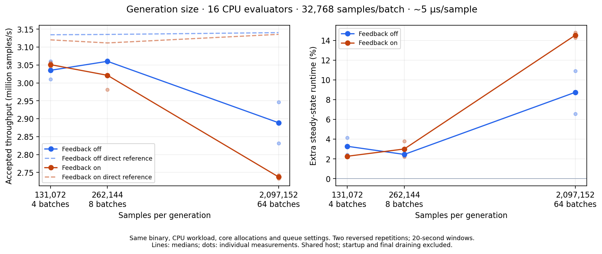

# Controlled generation-size comparison — 2026-10-03

Smaller generations improve throughput in both reversed repetitions. Using
131,072 rather than 2,097,152 samples per generation gives a median paired gain
of **11.45% with feedback** (11.05–11.85% across repeats) and **5.09% without**
(3.85–6.33%). The 262,144-sample setting is similarly effective: +10.36% with
feedback and +5.97% without. The small difference between the two smaller
settings does not establish a precise optimum; 131k is a reasonable choice for
this workload, with 262k a close alternative.

For training, evaluator compute busy rises from 90.3% to 98.5%, and the median
of the largest observed production steps drops from 269 ms to 13.4 ms. This
supports generation bursts interrupting work supply. It does not isolate a
particular instruction or prove that the proposed signature-remapping change
would remove the whole cost. The reference remains near 3.1 million samples/s;
these trials are below a four-million/s transport ceiling.



[PDF](generation-size.pdf) · [CSV](summary.csv) · [all paired measurements](results.json)

Only generation size changes within each feedback mode: 131,072, 262,144 or
2,097,152 samples (4, 8 or 64 evaluator batches). The evaluator fleet always has
16 physical cores, batches contain 32,768 samples, and the CPU workload always
uses 3,051 iterations/sample, approximately 5 µs/sample. There are no artificial
sleeps. These are materialized six-dimensional inputs; feedback returns x[0].
The unchanged binary is the improved scheduler from `a2fe46a`.

| Generation | Feedback | Production M/s | Direct M/s | Extra runtime | Evaluator compute busy | Largest production step (ms) |
| ---: | --- | ---: | ---: | ---: | ---: | ---: |
| 131,072 | off | 3.035 | 3.134 | 3.28% | 98.3% | 16.1 |
| 131,072 | on | 3.051 | 3.120 | 2.27% | 98.5% | 13.4 |
| 262,144 | off | 3.060 | 3.135 | 2.45% | 98.7% | 20.7 |
| 262,144 | on | 3.021 | 3.112 | 3.00% | 98.6% | 22.4 |
| 2,097,152 | off | 2.889 | 3.140 | 8.75% | 94.9% | 222.7 |
| 2,097,152 | on | 2.738 | 3.136 | 14.54% | 90.3% | 269.0 |

Values are medians of two repetitions. Extra runtime is the median of paired
`100 × (direct_rate / production_rate − 1)` values, not a ratio of group medians.
The production-step column is the median of each window's largest recorded
production step, including generation and partitioning; it is **not** a profile
of hash-map operations or pure RNG time. Busy fractions describe the measured
process lanes, not host CPU utilization.

Both paths use identical sampler/evaluator/accumulator engines, generation size,
batch size, CPU arithmetic and feedback policy within each pair. The direct
reference includes generation, partitioning, evaluation, accumulation and ordered
feedback. It excludes the database and production runners. All trials use the
same five sampler cores, four database cores, sixteen evaluator cores, four sampler
I/O threads, 1 GiB PostgreSQL shared buffers and queue settings. Core IDs are
recorded in the manifest. The machine is shared, not exclusively reserved.

Each repetition starts a fresh private database and worker fleet. Generation,
feedback-mode and direct/production measurement order reverse in the second
repetition. All observation windows target 20 seconds, extended if necessary by
the existing progress checks. Warmup and final draining are excluded. The direct
reference uses complete-generation completion endpoints. Feedback transports
and ingests values; it does not optimize an adaptive model.

All twelve comparisons passed the same validity and adequate-progress checks,
matched direct/production configurations, and both deployments shut down cleanly.
The two repetitions give engineering evidence, not publication confidence intervals.
Neither sampler generation defaults nor the proposed homogeneous-split fast path
were changed by this experiment.

## What the proposed splitting optimization means

[`LatentBatch::slice_at`](../../../../src/sampling/latent_batch.rs) rebuilds a
batch-local dictionary of discrete-coordinate signatures. This is useful when
different samples select different discrete channels: the selected batch can
carry only the signatures it uses, with remapped local indices.

In the continuous-only benchmark there is exactly one signature, the empty
tuple, and every index is zero. The generic loop nevertheless performs a hash-map
lookup per sample to rediscover the mapping `0 → 0`. That is roughly two million
lookups when partitioning the large draw. A single-signature path could validate
that the selected indices are zero, copy the one signature, and fill the output
indices with zeros. Mixed-signature batches would retain the existing remapping.
Continuous-coordinate and weight copies, shape validation, ownership and the
wire format would remain unchanged. This optimization was **not implemented or
benchmarked** here, so its contribution is not quantified by the production-step
timings above.

Reproduce from the repository root with an optimized current binary:

```bash
python docs/benchmarks/2026-10-03/generation-size/run_study.py \
  --binary "$CARGO_TARGET_DIR/dev-optim/gammaboard" \
  --output results/generation-size
```

The script uses 25 physical cores and private port offset 99. Results and complete
raw observation windows are written immediately. This folder includes the exact
driver, manifest, summaries and compressed raw measurements. Full immutable
binary and harness snapshots remain at
`/common/dev/cedric/setup-logs/generation-size-20261003/study/inputs`.
