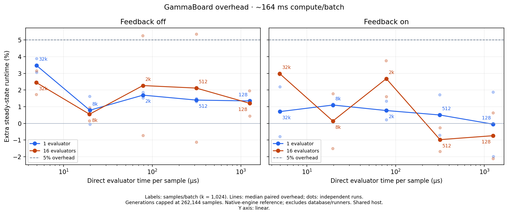
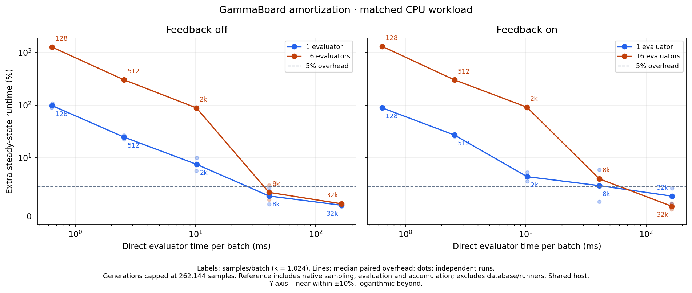

# Amortization with a shared generation limit

The runtime now calls `generate(max_samples)`, bounded by live queue
`max_generation_size` (default 262,144) and remaining task budget. Native samplers
have no separate generation-size setting. A live update affects the next draw;
existing draws and generation-level feedback finish unchanged. Training windows
remain independent. Process workers use the v4 contract; payload layouts and
evaluator callbacks are unchanged.

Binary SHA-256: `909eee663909131f0eec8177a616e86d291dff769f02616d793bbdb0b28cff95`.
Measured from a worktree based on `a2fe46a`; immutable executable and harness
snapshots are retained alongside the raw local studies.

At 16 evaluators and 32,768 samples/batch, the joint sweep measures **2.44%**
extra runtime without feedback and **2.98%** with feedback, at approximately
**3.11 million samples/s** in both modes. The corresponding earlier oversized-draw
measurements were 5.56% and 15.02%. This agrees with the controlled draw-size
experiment, but these full sweeps are separate shared-host runs, not a controlled
A/B attribution. The fixed-cost diagnostic measures 2.12% and 1.70% at the same
batch size; it still shows large costs for unrealistically small fast batches.

All tests and checks are recorded in [checks.json](checks.json), including Rust
1.99 Clippy with warnings denied, live API tuning, training/inference integration,
process round trips, and Python/frontend checks.

## Constant batch-time sweep



[PDF](constant-batch-time/amortization.pdf) · [SVG](constant-batch-time/amortization.svg) ·
[CSV](constant-batch-time/summary.csv) · [all pairs](constant-batch-time/results.json) ·
[raw windows and run cards](constant-batch-time/raw-measurements.json.gz)

Target: 163.84 ms of real CPU work per evaluator batch. The pairs are
(µs/sample, samples/batch): (5, 32,768), (20, 8,192), (80, 2,048), (320, 512),
(1,280, 128). The x axis uses measured evaluator time per sample, not the target.
Each case requests four batches per evaluator, capped at 262,144 samples;
smaller draws keep the slow cases practical. Both reference and production use
exactly the same draw size for a given pair. At 16 evaluators the 32,768-sample
case now uses 262,144 per draw, versus 2,097,152 in the earlier joint sweep.

Median extra steady-state runtime:

| Samples/batch | 1 evaluator, feedback off | 1 evaluator, feedback on | 16 evaluators, feedback off | 16 evaluators, feedback on |
| ---: | ---: | ---: | ---: | ---: |
| 128 | 1.34% | -0.05% | 1.20% | -0.74% |
| 512 | 1.40% | 0.50% | 2.12% | -0.98% |
| 2,048 | 1.69% | 0.77% | 2.27% | 2.68% |
| 8,192 | 0.79% | 1.10% | 0.55% | 0.14% |
| 32,768 | 3.47% | 0.71% | 2.44% | 2.98% |

## Fixed evaluation-cost diagnostic



[PDF](fixed-cost/amortization.pdf) · [SVG](fixed-cost/amortization.svg) ·
[CSV](fixed-cost/summary.csv) · [all pairs](fixed-cost/results.json) ·
[raw windows and run cards](fixed-cost/raw-measurements.json.gz)

Approximately 5 µs/sample, with the arithmetic iteration count held fixed across
batch sizes. Draws use 262,144 samples throughout, matching the new queue default;
the earlier fixed-cost study used 131,072. This is a diagnostic of small-batch
cost, not a recommended deployment policy for fast evaluators.

| Samples/batch | 1 evaluator, feedback off | 1 evaluator, feedback on | 16 evaluators, feedback off | 16 evaluators, feedback on |
| ---: | ---: | ---: | ---: | ---: |
| 128 | 97.84% | 88.64% | 1264.37% | 1300.36% |
| 512 | 24.56% | 26.90% | 301.49% | 300.76% |
| 2,048 | 8.87% | 6.75% | 88.26% | 91.22% |
| 8,192 | 3.45% | 5.21% | 4.07% | 6.37% |
| 32,768 | 1.86% | 3.43% | 2.12% | 1.70% |

## Measurement and limits

Extra runtime is `100 × (direct_rate / gammaboard_rate − 1)` for equivalent
accepted work. The direct reference uses the same native sampler, evaluator and
accumulator with a bounded in-memory pipeline; production uses the database and
normal runners. Six continuous coordinates, `f(x)=x[0]`; feedback includes actual
weighted values and sampler ingestion, without neural optimizer work. No sleeps
simulate the arithmetic. These are end-to-end runner measurements, not process-RPC
measurements or a GLNIS physics result.

Each sweep has 40 paired comparisons: 1/16 evaluators × five sizes × feedback
off/on × two repetitions. Second repeats reverse sizes, feedback modes and
reference/production order. Nominal windows are four seconds, extended by the
existing generation/progress checks when necessary. All 80 windows passed the
accepted/evaluated progress checks, all paired settings matched, and all eight
private deployments shut down cleanly. Validation JSON and CPU allocations are
included with each plot.

Roles use disjoint physical cores (five sampler, four database, up to sixteen
evaluators), four sampler I/O threads and a 1 GiB PostgreSQL cache. The host is
shared. Dots are the two repetitions, not confidence intervals; negative
measurements are retained. Comparison with the [earlier plots](../amortization/README.md)
also changes generation policy and core selections. It is not a controlled
estimate of an isolated code speedup. The earlier [controlled draw-size study](../generation-size/README.md)
is the stronger evidence for the generation-burst mechanism.

## Reproduce

```sh
just benchmark amortization --target-batch-seconds 0.16384 --duration 4 --repetitions 2 --output results/amortization-joint
just benchmark amortization --duration 4 --repetitions 2 --output results/amortization-fixed
```

Runtime source: `src/runners/sampler_aggregator.rs` and `src/runners/queue.rs`.
Benchmark source: `benchmarks/amortization.py` and `src/benchmark/amortization.rs`.
The exact local raw studies are under `/common/dev/cedric/setup-logs/queue-generation-20261003`.
