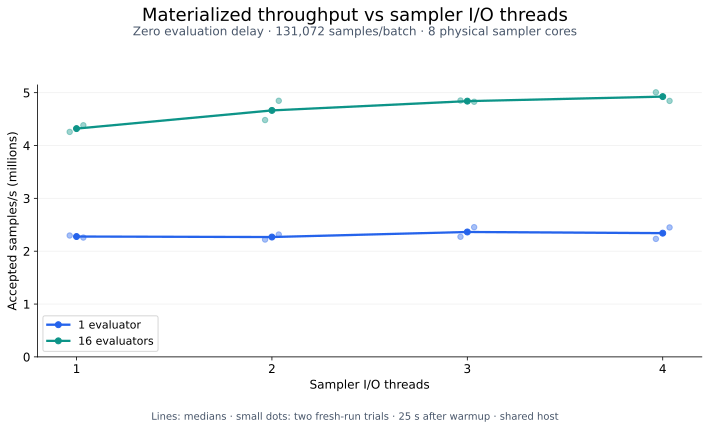
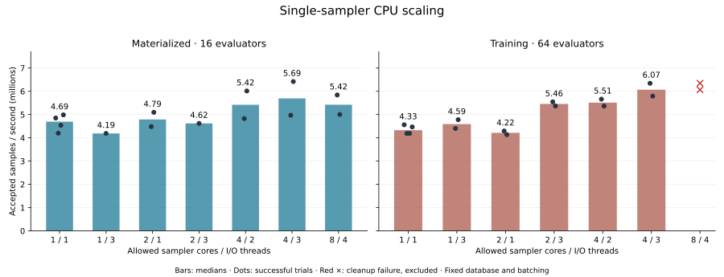
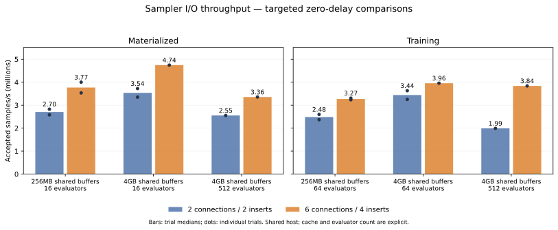
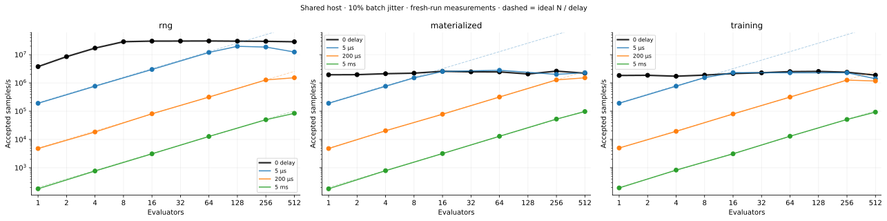
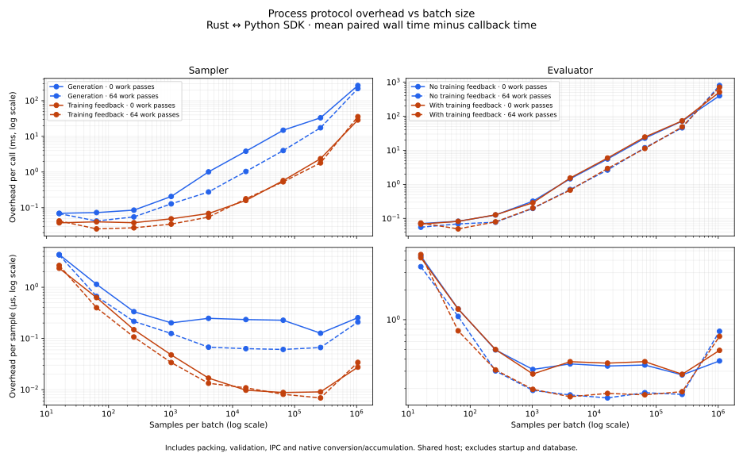

# Performance findings

Use [benchmarking](benchmarking.md) for commands, settings and validity rules.
This page records current measurements and retained mechanisms; historical
experiments are not current deployment defaults.

## Materialized I/O-thread scaling — 2026-10-01

With 16 evaluators, the dedicated sampler pool increased median accepted
throughput from **4.32M/s at one I/O thread to 4.93M/s at four (+14%)**.
Three threads reached 4.84M/s, within 2% of four. One evaluator stayed around
2.3M/s across the settings. This is the measured ceiling at the selected batch
and queue settings, not a search over every possible deployment configuration.

| Evaluators | 1 I/O thread | 2 I/O threads | 3 I/O threads | 4 I/O threads |
| ---: | ---: | ---: | ---: | ---: |
| 1 | 2.28M/s | 2.27M/s | 2.36M/s | 2.34M/s |
| 16 | 4.32M/s | 4.66M/s | 4.84M/s | 4.93M/s |



Only materialized input with compact evaluator results was measured here:
six-dimensional samples, `f(x) = x[0]`, zero artificial delay, 131,072 samples per
evaluator batch, and 4,194,304 samples per generation. The only run setting varied
was `[sampler_aggregator_runner_params].io_threads`. Queue settings were six
sampler database connections, four concurrent inserts, five batches per bundle,
a 10 ms tick, and 250 ms telemetry. PostgreSQL used 4GB of shared buffers.

All cases allowed eight physical sampler cores, fifteen separate database/server
cores, and one separate physical core per evaluator. Sixteen evaluators remained
registered throughout; either one or sixteen were assigned to the measured run.
The sampler averaged at most 0.95 CPU cores during any measurement; the largest
per-thread runnable scheduling wait was 0.53% of its interval. The core allowance
therefore showed ample headroom, including for the four-thread pool. The actual
thread counts and affinities were checked for every interval.

There were two fresh-run trials per configuration, each measuring 25 seconds
after the standard frontier warmup. The second block reversed the order.
All **16/16 trials** passed measurement and cleanup checks; the private deployment
also shut down cleanly. Total elapsed time was **8.3 minutes**. Lines show medians
and small dots show individual trials. These short shared-host trials show
repeatability, not confidence bounds; the small three-versus-four-thread gap
should not be treated as a precise ranking.

Source: local commit `3f3202c`, optimized `dev-optim` build. The
[portable results](benchmarks/2026-10-01/materialized-io-threads.json) retain both
trials, resource probes, exact settings and binary/harness hashes. The driver,
frozen binary and raw intervals are in
`/common/dev/cedric/setup-logs/materialized-io-frontier-20261001/`.

## Sampler CPU and I/O-thread scaling — 2026-09-30

**Extra sampler cores help when the I/O thread count also increases.** Four
allowed physical cores with three background I/O threads gave the best result
that completed both workloads cleanly: **5.69M/s materialized and 6.07M/s
training**, respectively 21% and 40% above the repeated one-core/one-thread
baseline. Giving the existing one-thread runtime a second core did not establish
an improvement. These are deployment candidates; application defaults are unchanged.

| Sampler cores | I/O threads | Materialized samples/s | Training samples/s | Successful trials, materialized / training |
| ---: | ---: | ---: | ---: | ---: |
| 1 | 1 | 4.69M | 4.33M | 4 / 4 |
| 1 | 3 | 4.19M | 4.59M | 1 / 2 |
| 2 | 1 | 4.79M | 4.22M | 2 / 2 |
| 2 | 3 | 4.62M | 5.46M | 1 / 2 |
| 4 | 2 | 5.42M | 5.51M | 2 / 2 |
| 4 | 3 | 5.69M | 6.07M | 2 / 2 |
| 8 | 4 | 5.42M | Cleanup failed twice | 2 / 0 |

Values are medians of successful trials. The two materialized CPU-allowance
checks with three I/O threads have only one trial each. Compare configurations
within a column: materialized used 16 active evaluators, training used 64.



The trials used one sampler/model and one private PostgreSQL database, with 64
registered evaluators. Fixed settings were six sampler connections, four concurrent
inserts, five batches per insert, 131,072 samples per evaluator batch, 4,194,304
samples per generation, and 4GB PostgreSQL shared buffers. The database/server had
15 allowed physical cores, and evaluators each had a separate core and one I/O
thread. All core sets were on the same CPU package and remained disjoint. Affinity
limits placement; it does not reserve cores against other host users.

Each interval followed the frontier warmup contract and requested 25 seconds of
measurement. The opening baseline was repeated after the main sweep. A further
fixed-three-thread comparison varied only the sampler's CPU allowance, with
reversed order for its repeated training trials. There were **28 successful
intervals and two excluded cleanup failures**, taking 24 minutes across the
private deployments, including warmup and shutdown. This remains a short,
shared-host, six-dimensional `f(x) = x[0]` transport study with zero evaluator
delay, not a sustained HPC-network or real-optimizer benchmark.

Serialization executes synchronously inside spawned I/O tasks. Multiple runtime
threads allow independent bundles to encode while other tasks handle database
traffic. In the fixed-three-thread training comparison, mean serialization wall
time per five-batch bundle fell from approximately **128 ms on one core**, to
**73 ms on two**, to **46 ms on four**. Training result-fetch time was about
4.3 ms with four cores/three threads versus 10.0 ms for the repeated baseline.
These observations support reduced scheduling delays and better overlap; they
do not imply parallel mutation of the sampler model. Average sampler CPU use at
four cores/three threads was only 0.92 cores materialized and 1.11 training:
short parallel bursts matter even when average CPU use is modest.

Both attempts at eight cores/four threads completed their first materialized run,
then failed cleanup after the training interval. The measured training rates,
6.35M/s and 6.07M/s, are retained as excluded points. PostgreSQL logged 30-second
statement timeouts in completed-batch deletion and subsequent run removal, both
while cascading into `batch_inputs`. Frequent WAL checkpoints and buffer/write
waits were also observed. The precise cause of the slow deletion is not isolated;
the evidence does not establish that four threads themselves cause it. The retry
kept all database limits unchanged. Both private deployments shut down cleanly,
and the failed databases/logs were retained for investigation.

For a high-throughput sampler node, **four cores with three sampler I/O threads**
is the strongest clean candidate from this study. These experiments varied the process-wide
`TOKIO_WORKER_THREADS`; the dedicated sampler pool added afterward exposes
`[sampler_aggregator_runner_params] io_threads = 3` instead and leaves the control
runtime separate. The numbers above describe the original experiment, not a
remeasurement of the new pool. Two cores/three threads recovered much of the
training gain. Additional cores or threads did not yield proportional scaling.
Payload cleanup and PostgreSQL checkpoint pressure need investigation before
raising throughput further. No production runtime code or configuration defaults
were changed for this experiment.

The [portable evidence](benchmarks/2026-09-30/sampler-cores.json) includes all
successful trials, excluded measurements, thread-affinity verification data and
binary/harness provenance. Reproduction scripts and raw logs are retained under
`/common/dev/cedric/setup-logs/sampler-cores-20260930/`.

## Sampler I/O tuning — 2026-09-30

**Six sampler connections and four concurrent inserts** improved the targeted
materialized/training comparisons and are now the run defaults. Evaluators remain
capped at two connections. Sampler admission reserves its four extra connections
without charging that overhead to every evaluator. Shutdown now joins an existing
cleanup DELETE before checkpointing or removing the run.

Matched zero-delay comparisons used `f(x) = x[0]`, six-dimensional inputs,
131,072-sample evaluator batches, 4,194,304-sample generations, five batches per
insert, one sampler core and fifteen PostgreSQL/server cores. Each confirmation
used the frontier warmup contract followed by at least 20 seconds of measurement.
The smaller studies registered 64 evaluators; the large-fleet study registered 512.
All trials used fresh runs within their study's ageing private database.

| Workload | Active evaluators | PostgreSQL shared buffers | 2 connections / 2 inserts | 6 connections / 4 inserts | Change |
| --- | ---: | ---: | ---: | ---: | ---: |
| Materialized | 16 | 256MB | 2.70M/s | 3.77M/s | +39% |
| Training | 64 | 256MB | 2.48M/s | 3.27M/s | +32% |
| Materialized | 16 | 4GB | 3.54M/s | 4.74M/s | +34% |
| Training | 64 | 4GB | 3.44M/s | 3.96M/s | +15% |
| Materialized | 512 | 4GB | 2.55M/s | 3.35M/s | +32% |
| Training | 512 | 4GB | 1.99M/s | 3.84M/s | +93% |

The 256MB confirmation rows are medians of two trials per configuration, with
reversed order in the second block. The smaller 4GB studies have two baseline
trials and one candidate; the 512-worker comparisons have one trial each. These
shared-host observations establish useful settings, not precise universal gains.
This is a targeted follow-up, not a replacement for the full sparse curves below.



The mechanism is bounded publication overlap with room left for result collection.
In one matched materialized pair, the reported mean completion-fetch time fell
from roughly 183 ms to 3.6 ms. Individual inserts can take longer while aggregate
throughput rises because four can run concurrently. Four connections with four
inserts were less effective; eight connections or eight inserts did not establish
an advantage over six/four.

Larger batches or bundles and a second sampler core did not beat the selected
settings in the screening trials. Increasing database affinity from 15 to 31 cores
also did not help the targeted 16-evaluator comparison. PostgreSQL used roughly
3–4 cores there. Input COPY, WAL and buffer/write waits remain useful next profiling
targets; the I/O busy fraction alone does not identify a hardware bandwidth limit.

A 4GB PostgreSQL cache reduced sampled data-file-write waits and raised the observed
rates further. The large-host frontier preset now uses that cache size and records
it explicitly. General deployments retain the 256MB memory default; see
[capacity planning](operations.md#capacity-planning) for the high-throughput setting.
Old benchmark suites without the new resource fields replay with two sampler
connections and 256MB, and comparisons reject differing resource settings.

Two independent deployments with disjoint CPU allocations achieved **7.38M/s
aggregate** (3.63M/s + 3.76M/s), versus 4.34M/s for one deployment on its own:
1.70× aggregate throughput using two samplers, two databases and twice the allocated
CPU/cache resources. These were barrier-aligned 40-second materialized measurements
with 16 evaluators and 4GB PostgreSQL shared buffers per instance, sharing the host
and storage. Independent deployments already support this scaling; a single
adaptive run still has one sampler and one ordered feedback stream.

Regression controls found no loss: tiny 256-sample batches remained around 0.34M/s,
and a 50-µs training workload remained around 0.316M/s (16 evaluators; ideal 0.32M/s).
RNG inference remained around 30M/s. These checks compare the new configuration
with the earlier benchmark settings or, for the small/delayed controls, the old
run default of two connections and eight inserts.

The initial stress study exposed the aborted-cleanup row-lock race fixed above.
Its failed attempt is retained in the development evidence. Two initial CPU-affinity
probes did not reach the PostgreSQL daemon and are excluded; corrected probes were
run afterward. All subsequent studies, including an eight-insert cleanup stress
case, shut down cleanly. The 348 Rust unit/binary tests, 37 PostgreSQL integration
tests and 52 benchmark harness tests passed. See the
[portable trial data and provenance](benchmarks/2026-09-30/summary.json).
The production Rust/Python process adapters are unchanged by this tuning.

## Generation baseline — 2026-09-29

The sampler-generation implementation was measured with the then-current sparse
frontier: **87 configurations**, three data paths, four delays and up to 512
evaluator processes. Initial coverage, missing-point follow-up and targeted repeats
took 60.1 minutes including deployment and cleanup. Of 92 attempts, 89 were valid;
all planned configurations have usable evidence.

The shared host was an AMD EPYC 9754. One core served the sampler, fifteen the
database/server, and evaluators shared 240 physical cores. The build used
`dev-optim` (optimization level 2). Delayed evaluators sleep; these are
coordination/transport measurements rather than CPU-bound scaling results.

| Mode | Zero-delay peak samples/s | Evaluators at peak | Samples/s at 512 | Fewer-worker candidate within 5% |
| --- | ---: | ---: | ---: | --- |
| RNG inference | 30.56M | 64 | 28.65M | 16 workers, 524,288 samples/batch |
| Materialized | 2.62M | 256 | 2.21M | 16 workers, 131,072 samples/batch |
| Training | 2.56M | 128 | 1.89M | 64 workers, 131,072 samples/batch |



At the zero-delay peaks, RNG sampler compute was 95.5% busy. Materialized/training
sampler I/O was 96.0%/95.6% busy, with sampler compute around 12–13%. Compute and
I/O overlap; these are occupied wall times, not CPU usage.

The 5-µs RNG curve used smaller 65,536-sample evaluator batches and peaked at
19.76M/s. Zero delay is not a universal ceiling for other batch choices.
At 200 µs, 256 evaluators delivered roughly 1.26–1.28M/s in all three modes,
close to the ideal 1.28M/s. Higher counts were less reliable:

| Repeated configuration | First samples/s | Repeat samples/s |
| --- | ---: | ---: |
| RNG, 5 ms, 512 evaluators | 67,175 | 101,298 |
| Training, 200 µs, 512 evaluators | 585,457 | 1,762,172 |

Both observations contribute to each plotted median. In the slow training
interval, roughly 500 batches remained locally queued while insertion was slow;
requested and actual mock sleep durations agreed. The fresh-deployment repeat
was faster. Publication/database contention is a useful next investigation,
but this does not isolate database history, CPU placement or shared-host load
as the cause. A short high-count point is not a stable deployment limit.

### Measurement corrections

One 512-evaluator training point exceeded the old 120-second warmup while making
progress. Warmup now allows five minutes within the suite budget. Two
single-evaluator training intervals missed feedback because a full generation
outlasted the old 12-second observation window. Training measurements now cover
two nominal generation cycles, independently of evaluator batches.

All three affected configurations passed their retries. Failures remain in the
evidence. The default suite now has a 60-minute limit and finishes early when
complete. Consolidation subsequently aligned accepted progress and feedback
with the same telemetry endpoints. Replaying all 89 valid intervals preserved
their rates and confirmed feedback inside every training interval.

## Process-API overhead

The production Rust/Python adapters completed 72 cases across nine batch sizes
from 16 to 1,048,576 samples in 74.7 seconds, excluding compilation. Inputs have
six continuous coordinates and one output component. Solid curves have minimal
callback work; dashed curves add 64 NumPy sine passes.



These are paired adapter wall times minus callback wall times, including packing,
validation, IPC, native conversion/accumulation and scheduling. Startup, input
construction, the database and worker fleet are excluded.

At 65,536 samples per call with minimal callback work:

| Operation | Overhead per sample |
| --- | ---: |
| Sampler generation | 0.227 µs |
| Sampler feedback | 0.009 µs |
| Evaluator, feedback off | 0.347 µs |
| Evaluator, feedback on | 0.375 µs |

Batching amortizes fixed per-call cost; conversion and transfer leave a per-sample
cost. Million-sample calls showed an upturn in this run. Callback workloads also
produced different residuals, so these are not universal constants. The largest
batch has only four measured repetitions per case.

Process correctness checks passed, including weighted feedback and worker reuse.
[Portable measurements and provenance](benchmarks/2026-09-29/summary.json) include
all frontier attempts, configuration medians and process summaries. Full raw
intervals, paired timings and executable inputs remain in the development study
artifacts; the guide describes reproduction.

## Improvements already retained

These came from earlier, differently configured experiments. Their speedups are
not matched comparisons against the current frontier.

- **Shorter transaction lock ownership.** Queue-counter updates are deferred to
  commit, so large input COPY operations do not hold the shared counter lock
  throughout transfer. Metadata and payload visibility remain atomic.
- **Less payload copying.** Borrowed arrays serialize directly into the COPY
  buffer before connection acquisition. New PostgreSQL input writes use LZ4 where
  supported. Earlier eight-evaluator controls rose from about 0.87M/s to 2.29M/s
  at 65,536 samples/batch across the retained changes; serialization preparation
  alone did not establish a separate throughput gain.
- **Flat sampler output and reusable Havana samples.** A shared indexed builder
  removed temporary per-sample points. A six-dimensional 131,072-sample draw fell
  from 393,240 allocations to six and from 43.8 to 9.4 MB of allocation traffic.
  A historical matched Havana comparison rose from 0.39M/s to 2.12M/s; allocation
  and freeing had dominated the earlier profile.
- **One generation lifecycle.** Samplers own draws and training barriers.
  Splitting, ordered whole-draw feedback and recovery share one path. Refill depth
  is a soft fixed threshold. External samplers use SDK 0.2.0/protocol v3; see
  [sampling](sampling.md).
- **Bounded overlap and readiness.** Evaluator prefetch/submit stay bounded.
  Completed handles awaiting collection do not count as busy. Fleet readiness is
  separate from completed-work warmup; cleanup uses shared deadlines.

Keep claim tokens, retained results during database retries, task-scoped
consumption and checkpointed generation/feedback state: they protect correctness.
Historical CPU frontiers, constant-one feedback and process echo tests are
superseded as current capability evidence. Use their saved harnesses only for
older-revision investigations.

Other focused follow-ups remain separate: GammaLoop entry-reset cost, finite
training windows/MadNIS behavior, and dependency numerical stability. An earlier
Havana fixture exposed tiny negative rounded variance for identical values of
1/6; varying benchmark feedback avoids that fixture but is not its numerical fix.

## 2026-10-01: benchmark consolidation and sampler resource limits

The maintained suite is now the `benchmarks` Python package, invoked with
`python -m benchmarks`. Shared deployment, CPU allocation, input snapshots and
reporting live in one place; Python defines the measurement policy and Rust
helpers exercise production storage and process adapters. The old script entry
points, search phases and unused presets are gone. Reports link separate plots
and data rather than embedding them in a combined HTML file.

This suite used a materialized transport cap of 131,072 samples, with 65,536
selected for the zero-delay frontier. The default was subsequently reduced to
32,768; see the default revision below. The I/O sweep is 256, 4,096, 16,384, 65,536,
131,072; the protocol sweep spans 16–131,072. Generation retains its independent
4,194,304-sample cap. All default sampler I/O sizes use 64 queue slots and
five-batch insert bundles within the 2 GiB payload budget. Larger overrides remain
available and record any memory-induced reduction in buffering.

### Controlled resource probes

Six-dimensional prepared samples, `f(x)=x[0]`, four sampler I/O threads allowed on
eight physical cores, four concurrent inserts, sixteen consumers, 65,536 samples
per batch. Roles use fixed disjoint CPU sets. Each trial creates a fresh private
PostgreSQL database. Two repeats reverse the order, with 2 seconds of warmup and
8 seconds measured for resource probes, 10 seconds for the storage comparison.
These are short shared-host comparisons, not confidence intervals or isolated
hardware limits.

| Change from baseline | Median million samples/s, feedback off |
| --- | ---: |
| 12 database cores, 2 GiB shared buffers | 7.04 |
| 24 database cores | 7.94 |
| 8 GiB shared buffers | 7.69 |
| Eight inserts / ten connections | 8.04 |
| 128 queue slots | 7.44 |
| 32 consumers | 6.91 |
| 131,072 samples/batch | 5.28 |
| 1,048,576 samples/batch, 2 GiB payload budget | 5.10 |
| 1,048,576 samples/batch, 16 GiB / fixed 64 slots | 3.93 |

Extra database CPU, cache and inserts offered roughly 9–14% median gains. The
baseline varied from 6.67 to 7.41 M/s, so these small differences warrant longer
confirmation before changing production defaults. Neither extra consumers nor
more queue depth provided a substantial improvement. Fixing the queue depth at
million-sample batches did not recover throughput: the slowdown is not solely a
buffer-size artifact. It also raised the insert bundle back to five huge batches,
so this comparison does not isolate individual large-value costs from bundle size.

| Database filesystem | Feedback off, M/s | Feedback on, M/s |
| --- | ---: | ---: |
| Disk-backed `/tmp` | 7.21 | 6.74 |
| RAM-backed `/dev/shm` | 9.69 | 9.35 |

Changing only database placement improved the medians by 34% and 39%. The
RAM-backed database is deliberately temporary and is not a durability-equivalent
production deployment. This is evidence of storage-path headroom; it does not
promise the same gain from a particular disk. The CLI now accepts
`--database-directory PATH` so this comparison is easy to repeat.

About 89–90% of completed insert-operation time was in payload COPY, 9% in
serialization, with small metadata/commit contributions. These are overlapping
operation times, not percentages of sampler wall time. Active-backend samples
showed buffer-content, WAL-write and relation-extension waits; eight concurrent
inserts increased extension-lock observations substantially. Busy remained near
100% because it includes waits. This identifies the database payload path as the
primary measured limit, not lack of sampler runtime threads. It does not separate
all CPU, compression, copying and storage costs inside COPY.

Large `bytea` values are stored in many TOAST chunks; bigger evaluator batches
amortize batch metadata but do not remove per-byte work or shared database
contention. See PostgreSQL's [TOAST description](https://www.postgresql.org/docs/17/storage-toast.html)
and [wait-event definitions](https://www.postgresql.org/docs/17/monitoring-stats.html).

The most promising next resource experiment is faster durable storage for the
database and WAL. Beyond that, independent queues/databases may reduce shared
contention; this study did not test sharding or establish linear scaling. Raising
sampler threads, database cores, cache or inserts is not an N-times throughput knob.
No production storage or durability settings were changed.

[Resource comparison plot](benchmarks/2026-10-01/consolidated/resources.svg),
[CSV](benchmarks/2026-10-01/consolidated/resource-summary.csv),
[raw-summary/provenance](benchmarks/2026-10-01/consolidated/resource-summary.json).
Full trial data and runnable probe drivers are retained locally at
`/common/dev/cedric/setup-logs/benchmark-resources-20261001/`.

### Full consolidated suite and follow-up

The complete default suite ran with the same optimized executable across all four
families and finished in **49.2 minutes**. The frontier alone took 35.5 minutes,
including registration, warmup, measurements and cleanup. Coverage was 58/58 valid
frontier points through 512 evaluators in both feedback modes, 80/80 valid sampler
I/O trials, 20/20 valid evaluator I/O trials, and 40 protocol cases across eight
batch sizes (1,720 paired measured calls). I/O busy never fell below the warning
threshold: minima were 93.6% for the sampler and 99.8% for the evaluator. Every
private database and worker fleet cleaned up successfully.

| Measurement | Feedback off | Feedback on |
| --- | ---: | ---: |
| Peak observed zero-delay full pipeline | 6.30 M/s | 5.25 M/s |
| Best sampler I/O median | 8.22 M/s | 7.58 M/s |
| Best evaluator I/O median | 6.52 M/s | 6.27 M/s |
| Process sampler overhead at 65,536 samples | 9.55 ms | 10.08 ms |
| Process evaluator overhead at 65,536 samples | 14.55 ms | 15.00 ms |

Full-pipeline zero-delay peaks used 32 evaluators without feedback and 128 with
feedback; training at 32 was within 1% of its peak, so 32 is the cheaper selected
configuration. Sampler I/O peaked at 16,384 samples/batch in both modes, with eight
threads without feedback and two with feedback. Nearby two/four/eight-thread
results overlap substantially; this is not evidence that each mode requires a
different thread count. Evaluator I/O peaked at 65,536 without feedback and
131,072 with feedback. These are best observed configurations from a small sweep,
not guarantees for other machines or payloads.

The measured zero-delay frontier used 65,536 as its selected **full-pipeline**
batch size: the isolated sampler's 16,384-sample optimum does not by itself
establish the best end-to-end batch size. These results predate the 32,768 default.
Process overhead is adapter wall time minus callback work, including native
conversion/accumulation; sampler feedback-on sums generation and feedback calls.
It is not pure pipe latency and should not be subtracted from the I/O capacities.

A subsequent code review found that the sampler timing includes
`Generation::into_batch()`, expanding the flat generation into individual samples.
The production sampler runner does not require this conversion. The saved numbers
and plots retain that cost and therefore do not establish a process-API ceiling
for the production generation path. The measurement correction is still pending.

The 5 µs, 512-evaluator materialized point was unusually slow in the full sweep:
**0.933 M/s**. A separate same-binary follow-up with a fresh database and a
30-second window measured **4.288 M/s**, with valid counters and clean shutdown.
Sampler I/O busy changed from 100% to 86.7%. The follow-up also selected different
physical cores and ran under different shared-host load. The original collapse
therefore is not a reproducible ceiling, but this test cannot distinguish database
history, host contention, core placement and interval length as its cause. The
original point remains in the frontier plot and raw data, with an explicit note;
the follow-up is saved separately. High-fleet results need repeated confirmation
before being used as deployment limits.

Run the suite with the current defaults from the repository root (the saved
manifest records the earlier settings used for these measurements):

```bash
python -m benchmarks all --budget 7200 --output results/full
```

The budget is only a maximum allowance, not an extension of each measurement.
The completed run is at `/common/dev/cedric/setup-logs/benchmark-full-20261001/`;
the follow-up is at
`/common/dev/cedric/setup-logs/benchmark-frontier-followup-20261001/`.
Plot labels and reports were regenerated afterward without changing measurements.
The local suite index is about 1.3 KiB and links separate family reports and files.

| Family | Plot | Data |
| --- | --- | --- |
| Frontier | [SVG](benchmarks/2026-10-01/consolidated/frontier.svg) | [All 58 points, CSV](benchmarks/2026-10-01/consolidated/frontier-points.csv), [raw records](benchmarks/2026-10-01/consolidated/frontier-results.jsonl) |
| Sampler I/O | [SVG](benchmarks/2026-10-01/consolidated/sampler-io.svg) | [CSV](benchmarks/2026-10-01/consolidated/sampler-io-summary.csv), [raw trials](benchmarks/2026-10-01/consolidated/sampler-io-results.jsonl) |
| Evaluator I/O | [SVG](benchmarks/2026-10-01/consolidated/evaluator-io.svg) | [CSV](benchmarks/2026-10-01/consolidated/evaluator-io-summary.csv), [raw trials](benchmarks/2026-10-01/consolidated/evaluator-io-results.jsonl) |
| Process API | [SVG](benchmarks/2026-10-01/consolidated/protocol.svg) | [CSV](benchmarks/2026-10-01/consolidated/protocol-summary.csv), [paired timings](benchmarks/2026-10-01/consolidated/protocol-measurements.json) |
| 512-evaluator follow-up | Separate explicit point | [Result](benchmarks/2026-10-01/consolidated/frontier-followup-results.jsonl), [configuration](benchmarks/2026-10-01/consolidated/frontier-followup-manifest.json) |

Validation: 38 Python harness tests; 342 Rust library tests passed (one unrelated
ignored test); eight CLI tests; the explicitly enabled Python/NumPy process-adapter
round-trip test. No production behavior changed in the final reporting pass.

### Default revision after the suite

The run default, training/sample template and frontier preset now cap evaluator
batches at **32,768 samples**. Generation remains independent. The diagnostic I/O
and protocol sweeps still include larger sizes to expose the throughput decline.
The results above were measured before this default revision and are unchanged.

At the user's requested aggregation, the arithmetic mean of all 20 original
zero-delay points is **4.454135 M/s**: 4.574347 M/s without feedback and
4.333923 M/s with feedback. Each evaluator count and mode has equal weight;
low-count unsaturated points are included. This is an average reference, not an
estimate of peak saturation throughput. The saved frontier plot includes the
combined mean as a dashed line; [calculation data](benchmarks/2026-10-01/consolidated/frontier-ceiling.json)
records the source points. The annotation was applied to saved artifacts without
changing the plotting implementation.

The four-slide plot-only presentation is available as
[PDF](benchmarks/2026-10-01/consolidated/benchmark-plots.pdf) and
[Markdown](benchmarks/2026-10-01/consolidated/benchmark-plots.md). Its sampler I/O
slide selects the production default of one thread from the existing trials.
The complete thread sweep and resource comparisons remain in the research data.
