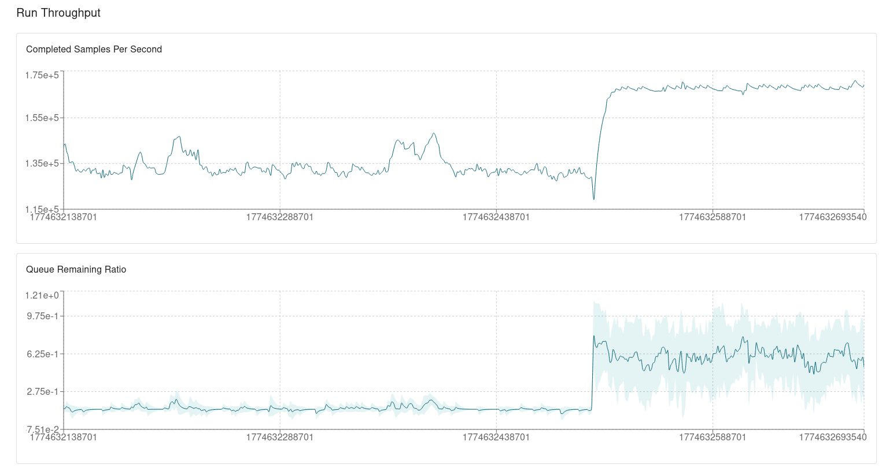

# ITPhlies Performance Report

Date: 2026-03-27
Run config: `configs/runs/gammaloop-triangle.toml`
Focus: Havana training and Havana inference comparison (`target_batch_eval_ms = 500`, `max_batch_size = 16384`)

## Summary
Havana training reaches a stable high-throughput regime near the configured batch-eval target.
In Havana inference, worker CPU remains high while PostgreSQL CPU load drops significantly, indicating lower control-plane overhead than training.

Screenshot (training -> inference transition):

## Observations (Havana Training)
- `Current Batch Size`: `8,319`
- `Max Batch Size`: `16,384`
- `Current Batch Eval (ms)`: `492.39`
- `Target Batch Eval (ms)`: `500`

CPU/process snapshot:
- Main `gammaboard` workers are mostly in the ~`75%` to `92%` CPU range, with one lower worker around `~59%`.
- One additional `gammaboard` process is around `~25%` CPU (likely non-main worker role/coordination path).
- PostgreSQL shows three hot backends around `~26-27%` CPU each, plus several lower-CPU backends.

Interpretation:
- Training loop is close to the intended latency target and appears throughput-stable.
- DB activity is non-trivial (higher than idle baseline), but compute workers still dominate aggregate load.
- Remaining worker CPU spread suggests mild imbalance/coordination overhead, not hard I/O stall.

### Transition Screenshot Notes (Training -> Inference)
Use the new transition screenshot instead of the older steady-state screenshot.
Key points from the transition view:
- `Completed Samples Per Second` ramps up quickly from low initial values to a stable plateau around `~1.23e5` to `~1.35e5`.
- A short peak reaches roughly `~1.5e5`, then settles back near the prior plateau.
- `Queue Remaining Ratio` drops from near `~1.0` during warm-up to a low steady band around `~0.1` to `~0.2`.

Takeaway from the screenshot:
- The system reaches and holds a stable high-throughput regime after startup.
- Queue control appears healthy (no sustained backlog growth), with only short transients.

## Config Context
Relevant runner params from `gammaloop-triangle.toml`:
- `target_batch_eval_ms = 500.0`
- `max_batch_size = 16384`
- `max_queue_size = 4096`
- `max_batches_per_tick = 8`
- `completed_batch_fetch_limit = 4096`

## Observations (Havana Inference)
Batch-control metrics:
- `Current Batch Size`: `8,489`
- `Max Batch Size`: `16,384`
- `Current Batch Eval (ms)`: `501.48`
- `Target Batch Eval (ms)`: `500`

CPU/process snapshot:
- Main `gammaboard` workers are mostly in the ~`86%` to `91%` CPU band, with one around `~77%`.
- Additional non-main `gammaboard` process is around `~14%`.
- PostgreSQL hot backends are around `~4.5%` each (much lower than the training snapshot where top postgres workers were ~`26-27%`).

Interpretation:
- Inference phase keeps high compute utilization while reducing DB pressure.
- Batch controller is tracking target very closely (`501.48 ms` vs `500 ms`) at roughly half of configured max batch size.
- Compared to training, inference appears less coordination-heavy at the database layer.
- This is consistent with expected behavior: inference uses trained state and typically requires less update-heavy sampler coordination than training.

## Training vs Inference (Short Comparison)
- Worker CPU: high in both phases; inference is slightly more uniform among top workers.
- PostgreSQL CPU: clearly lower in inference (`~4.5%` hot backends) than training (`~26-27%` hot backends in the sampled window).
- Operationally: training is the heavier control-plane phase; inference is closer to pure compute execution.
